<p align="center"></p>
<h2 align="center">清新简约 · 灵活多变</h2>
<p align="center">九层之台，起于累土；千里之行，始于足下</p>
<p align="center">
    <a href="https://spring.io/projects/spring-cloud" target="_blank"></a>
    <a href="https://github.com/alibaba/spring-cloud-alibaba" target="_blank"></a>
    <a href="https://spring.io/projects/spring-boot" target="_blank"></a>

</p>
<p align="center">
    <a href="https://bell-sw.com/pages/downloads/#downloads" target="_blank"></a>
    <a href="https://nacos.io/zh-cn/index.html" target="_blank"></a>
    <a href="https://github.com/spring-projects/spring-authorization-server" target="_blank"></a>
    <a href="https://github.com/spring-projects/spring-authorization-server" target="_blank"></a>
</p>
<p align="center">
    <a href="https://gitee.com/woscosmos/mesh-platform"></a>
    <a href="https://gitee.com/woscosmos/mesh-platform"></a>
</p>

<p align="center">
    <a href="https://gitee.com/woscosmos/mesh-platform">Gitee 仓库</a> &nbsp; | &nbsp;
    <a href="http://doc.woscosmos.com">系统文档</a> &nbsp; | &nbsp;
    <a href="http://www.woscosmos.com">官网地址</a>
</p>

<h1 align="center">如果这个项目可以帮助您，请记得 ✨Star 鼓励与支持一下❤️!!!</h1>

## ☁️平台说明

**蝉鸣数字** 致力于满足中小微企业管理活动多面手为愿景的**低代码** **可视化搭建**平台。以**低代码**为业务底座，高度灵活的创建应用，设计模块、页面，配置前端**事件流** ，结合独有的**流程配置**，可以快速实现**CRM**、**OA**、**人力资源**、**项目管理**、**进销存**、**财务资金管理**等多种业务需求。

## 🌐 地址说明

| 说明    | 地址                           | 
|-------|------------------------------|
| 官网地址  | 🌐<http://www.woscosmos.com> |
| CRM地址 | 🌐<http://crm.woscosmos.com> |
| 文档地址  | 🌐<http://doc.woscosmos.com> |

## 🔍 仓库说明

| 项目   | 地址                                                         |
|--------|------------------------------------------------------------|
|  GitHub | [🚀mesh-platform](https://gitee.com/woscosmos/mesh-platform) |
|  Gitee | [🚀mesh-platform](https://gitee.com/woscosmos/mesh-platform) |

## 🎨设计说明

**初衷** 秉承用最小的工作满足多种多样的业务需求，去除**简易业务**繁琐的开发环节，可以最大程度的满足业务的丰富性，节约业务变更时间。

**愿景** 致力于不仅贡献**高质量**、**低耦合**的脚手架功能，还追求**业务功能**的 **丰富**性、 **灵活**性，给到常用通用的功能，可作借鉴亦可去芜存菁。

**特色**
- 多主题
 
 系统风格清新简约，支持设置多种主题以及导航模式。
  <table>
    <tr>
        <td>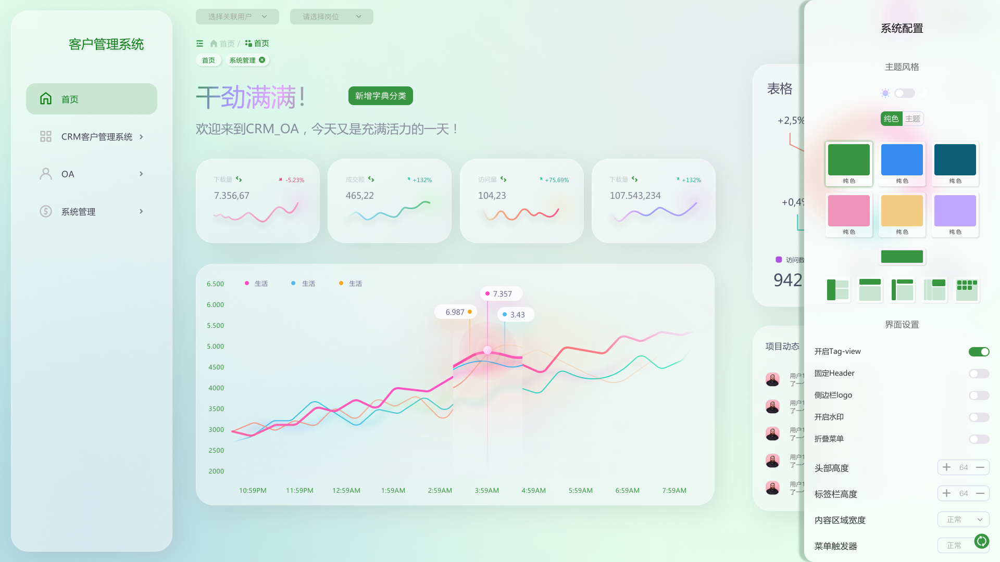</td>
        <td></td>
    </tr>
  </table>

- 多账户

  同一个用户可以创建多个登录账号，支持不同类型的登录方式。[**参考文档**](http://doc.woscosmos.com/zh/tutorial/third/dingtalk.html)
  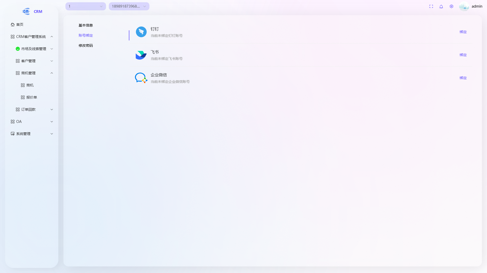
  例如：**账号1**：手机/密码，**账号2**：手机/验证码，**账号3**：邮箱/密码，**账号4**：钉钉登录，**账号5**：企微登录，**账号6**：飞书登录。
- 多组织
  
  同一个用户可以在不同公司下的多个部门以及岗位任职。系统以岗位为维度设置数据权限，与角色设置菜单权限区分开来，与公司现有只能权限划分一致，方便前台工作人员理解与接受。
  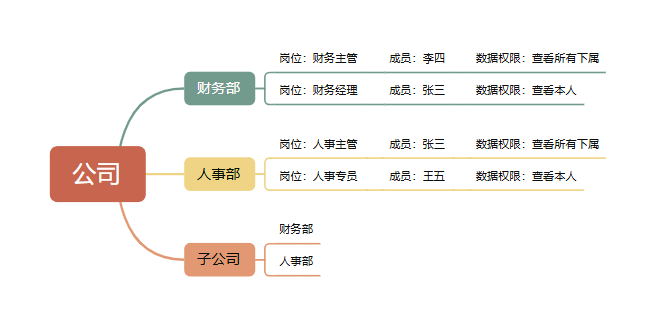
- 事件流
  
  事件流主要用于前端低代码配置，使用滴滴 [**Logic-flow**](https://site.logic-flow.cn/)框架，可以灵活的实现应用模块功能。
- 工作流

  工作流主要用于后端审批/流程配置，webview使用滴滴 [**Logic-flow**](https://site.logic-flow.cn/)框架，后端纯手撸。
  未使用开源流程框架原因：希望打造高颜值的系统，activity,flowable,camunda 流程设计页面元素有点陈旧，功能相对比较重,扩展功能繁琐，与系统结合度有点差异；仿钉钉与飞书类型的设计器页面和想要的也有出入。选择[**Logic-flow**](https://site.logic-flow.cn/)框架
是因为流程支持json格式较bpmn易于查看，最重要的是页面设计可以多种风格，自定义难度小，可以打造适合自己的设计器，但是没有后端对接，所以萌生从零手撸一个与系统结合度高，并且方便以后自我扩展的流程中心。

## 🧩业务功能

### ⚙️系统功能
| 分类   | 功能   | 描述                                |
|------|------|-----------------------------------|
| 系统中心 | 人员管理 | 以社会唯一属性维度存放用户数据。社会唯一属性例如身份证，手机号码等 |
|      | 账户管理 | 同一用户可以存在多个账户                      |
|      | 菜单管理 | 配置系统菜单、操作权限、按钮权限标识等               |
|      | 角色管理 | 设置角色，按角色进行菜单权限划分                  |
| 组织中心 | 组织管理 | 配置系统组织机构                          |
|      | 岗位管理 | 配置系统用户所属担任职务，按岗位进行数据范围权限划分        |
|      | 成员管理 | 配置系统用户所属组织，允许同一成员在多个组织以及岗位下任职     |
| 业务中心 | 应用管理 | 配置系统应用                            |
|      | 字典管理 | 配置系统中经常使用的一些较为固定的数据               |
| 流程中心 | 流程分组 | 配置系统流程自定义分组                       |
|      | 流程模板 | 配置系统流程模板信息                        |
| 配置中心 | 基本配置 | 配置系统公司信息，图标背景等信息                  |
|      | 个性化  | 配置系统UI风格、字体等信息                    |
|      | 安全   | 配置系统登录决策，密码决策等信息                  |
|      | 通用   | 配置系统前端交互配置等信息                     |

### 👥CRM功能
| 分类    | 功能   | 描述                                   |
|-------|------|--------------------------------------|
| 市场及线索 | 线索   | 初步接触尚未确认其购买意向或资质的客户信息                |
|       | 线索池  | 内部无明确负责人的线索信息                        |
| 客户管理  | 客户   | 已完成身份验证并建立业务关系的客户信息                  |
|       | 联系人  | 客户内部对接的人员信息                          |
|       | 跟进记录 | 客户跟进信息                               |
|       | 公海   | 内部无明确负责人的客户信息                        |
| 商机    | 商机   | 经过验证且具备明确成交可能的业务机会，销售管道中可量化的潜在收入的录信息 |
|       | 报价单  | 企业向客户提供的正式价格文件的录信息                   |
| 订单回款  | 合同   | 具有法律约束力的商业协议文件，明确交易双方的权利义务的录信息       |
|       | 回款   | 客户支付款项信息                             |
|       | 发票   | 提供给客户的发票信息                           |

### 👥PLM功能
| 分类     | 功能     | 描述             |
|----------|----------|------------------|
| 产品管理 | 产品     | 定义产品         |
| 产品分类 | 产品大类 | 产品SKU分类      |
|          | 产品物料 | 产品细分明细     |
| 设计管理 | 产品设计 | 产品物料组成明细 |
|          | 工序设计 | 产品结构说明     |

### ⏰OA功能
| 分类   | 功能   | 描述              |
|------|------|-----------------|
| 任务   | 计划   | 计划要做的任务         |
|      | 待办   | 未完成的任务          |
|      | 分配   | 他人转交/分配任务       |
| 审批   | 申请审批 | 请假，差旅等申请入口      |
|      | 待办审批 | 需要处理的未完成审批      |
|      | 已办审批 | 参与过的且已经处理的审批    |
|      | 归档审批 | 已经结束的审批         |
|      | 跟进审批 | 参与过的审批，无关审批是否结束 |
|      | 审批统计 | 审批基本统计          |
| 日志   | 日报   | 日报信息            |

## 🤖 后端技术栈

| 技术分类      | 技术 Logo & 名称                                                                                                                                                                  | 版本要求     | 描述                                                                 |
|-----------|-----------------------------------------------------------------------------------------------------------------------------------------------------------------------------------|--------------|---------------------------------------------------------------------|
| **JDK**   |  [OpenJDK](https://openjdk.org)                                                                           | `21` (LTS)   | Java 开发工具包，推荐长期支持版本                                   |
| **构建**    |  [Maven](https://maven.apache.org)                                                                 | `3.9+`       | 标准依赖管理和项目构建工具，支持约定优于配置                         |
| **框架**    |  [Spring Boot](https://spring.io/projects/spring-boot)                                                   | `4.1.1`      | 快速构建生产级应用的微服务框架                                       |
|           |  [Spring Cloud](https://spring.io/projects/spring-cloud)                                                 | `2025.1.3`   | 分布式系统开发工具包                                                 |
|           |  [Spring Cloud Alibaba](https://spring.io/projects/spring-cloud-alibaba)                                 | `2025.1.0.0` | 阿里云微服务解决方案                                                 |
| **数据库**   |  [MySQL](https://www.mysql.com)                                                                           | `8.0+`       | 主流关系型数据库，支持 ACID 事务                                     |
|           |  [Redis](https://redis.io)                                                                                  | `7.0+`       | 高性能内存键值数据库，支持缓存和消息队列                             |
|           |  [Elasticsearch](https://www.elastic.co)                                                            | `9.0.0+`     | 全文搜索引擎和分析引擎                                               |
| **中间件**   |  [Mybatis Plus](https://baomidou.com)                                 | `3.5.16`     | 增强版 MyBatis，简化开发                                             |
|           |  [Dynamic-Datasource](https://github.com/baomidou/dynamic-datasource) | `4.5.0`      | 动态数据源管理                                                       |
|           |  [Hutool](https://hutool.cn)                                                                  | `5.8.47`     | Java 工具类库                                                       |
|           |  [JustAuth](https://justauth.wiki)                                                   | `3.0.1`     | 第三方登录工具库                                                     |
|           |  [XXL-Job](https://www.xuxueli.com/xxl-job)                                                  | `3.4.2`      | 分布式任务调度平台                                                   |
|           |  [Fesod](https://github.com/dhatim/fastexcel)                                                                            | `2.0.2-incubating`      | 高性能 Excel 操作库                                                 |
|           |  [Knife4j](https://doc.xiaominfo.com)                                                                                      | `4.5.0`      | Swagger 增强 UI                                                     |
|           |  [OSS](https://help.aliyun.com/product/31815.html)                                                                       | `2.31.40`    | 阿里云对象存储服务                                                   |

## 🪛 工具及插件

| 技术分类       | 技术 Logo & 名称                                                                                              | 描述                                                                 |
|----------------|-----------------------------------------------------------------------------------------------------------|----------------------------------------------------------------------|
| **其他**       | [ ES-Client](https://es-client.esion.xyz/)                  | 小巧精美的Elasticsearch 操作工具                                                 |
|                | [ Tiny RMD](https://github.com/tiny-craft/) | 小巧精美的Redis 操作工具                                                       |
|                | [ Hex Hub](https://www.hexhub.cn/)  | 小巧精美的数据库，SSH, Docker运维操作工具                                                       |

## 💻 界面说明
<table>
    <tr>
        <td>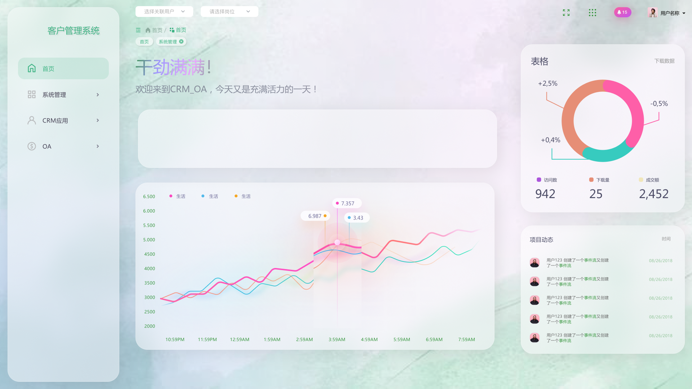</td>
        <td>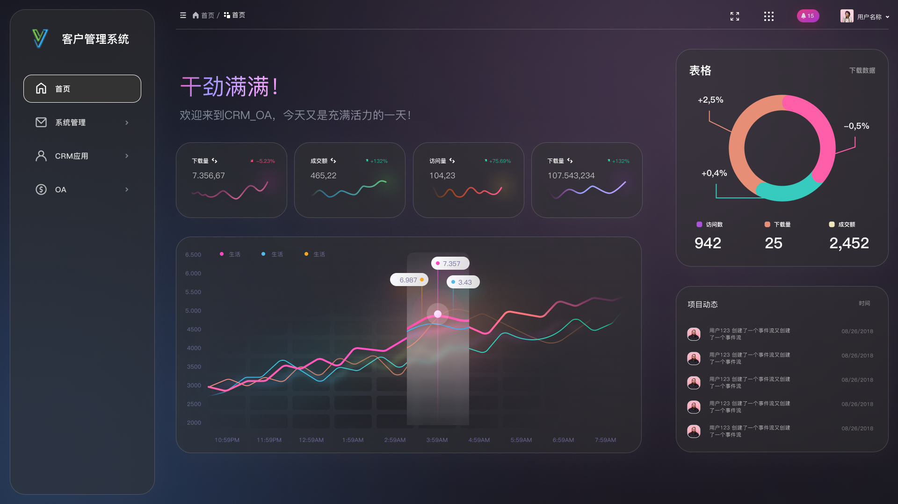</td>
        <td>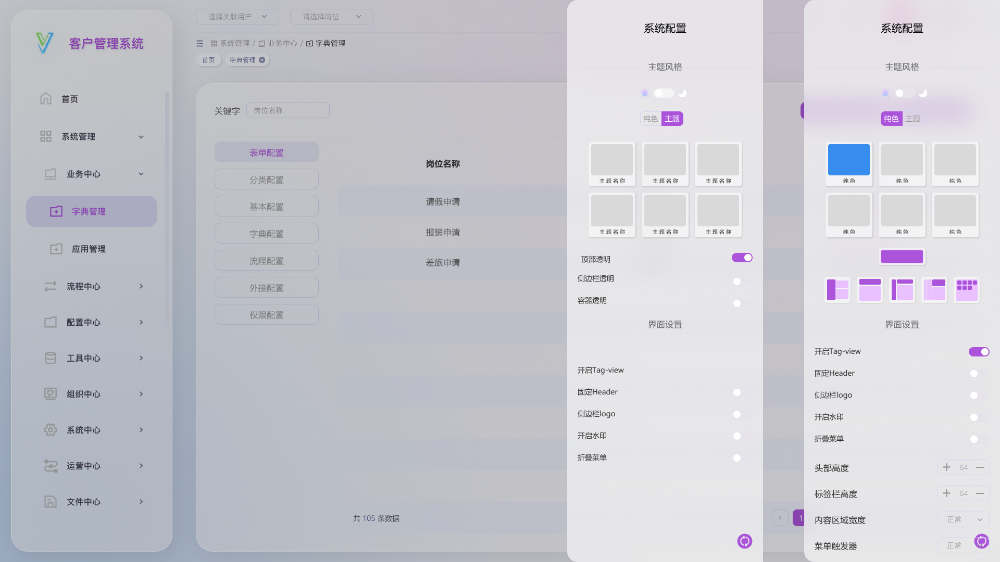</td>
    </tr>
    <tr>
        <td>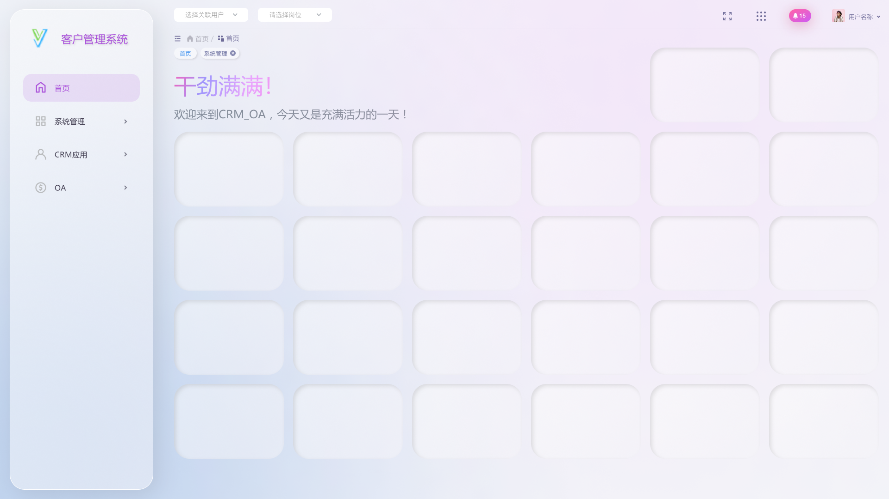</td>
        <td>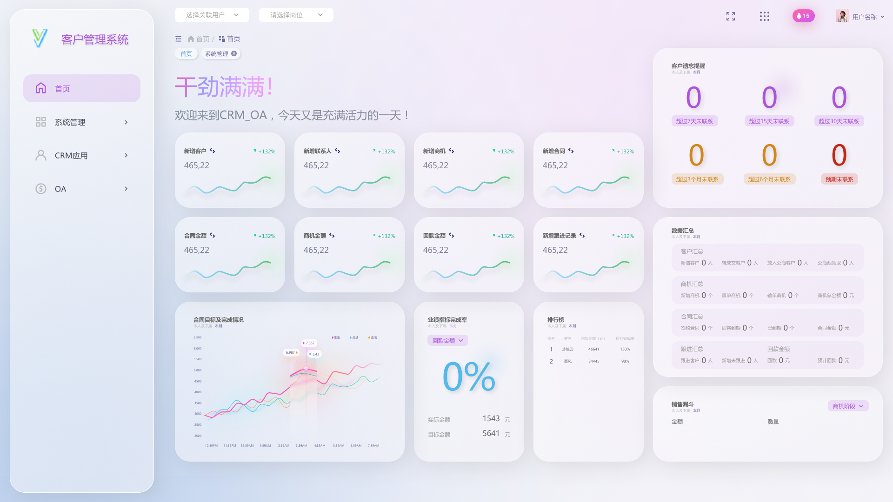</td>
        <td>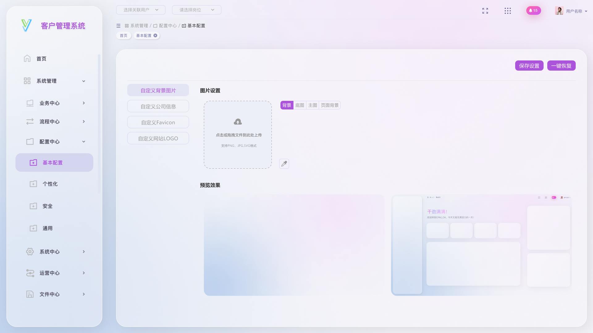</td>
    </tr>
    <tr>
        <td>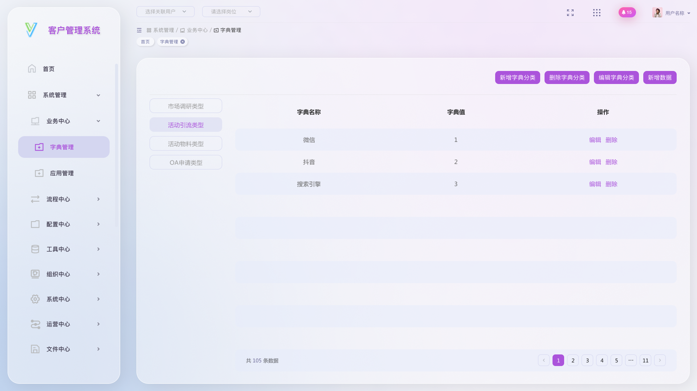</td>
        <td>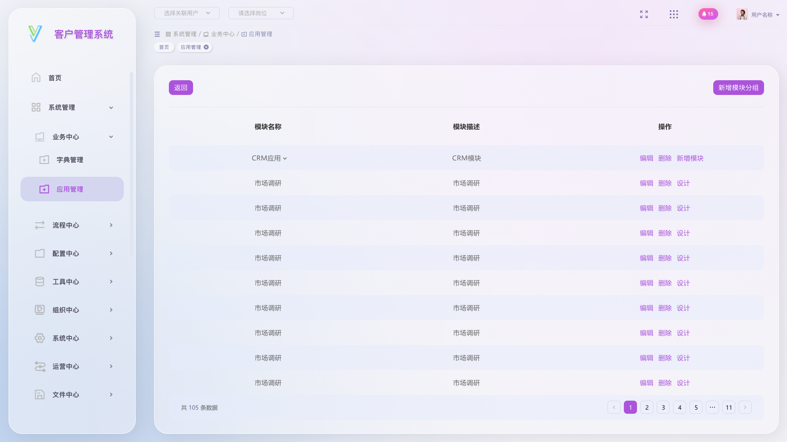</td>
        <td>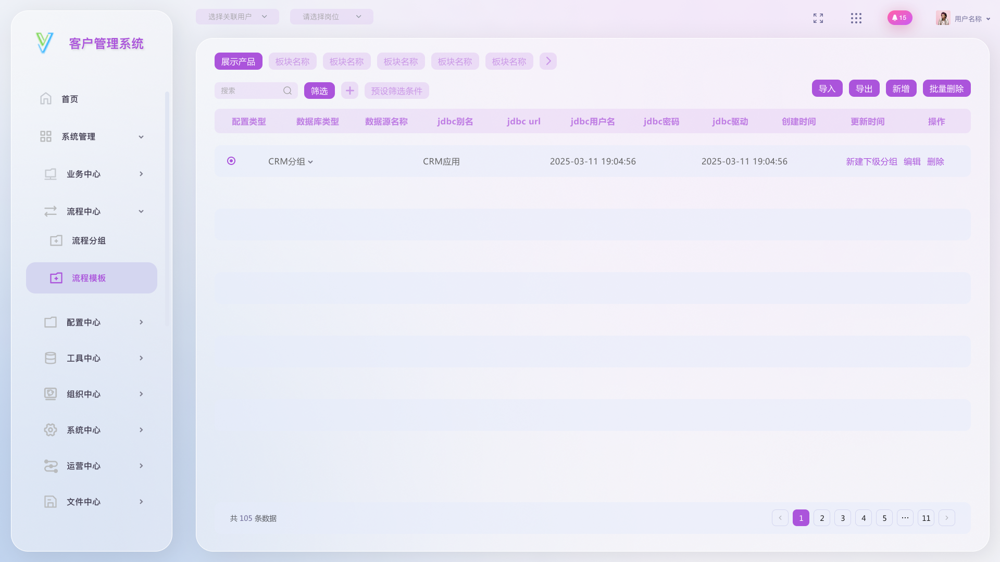</td>
    </tr>
</table>

## 快速部署

在后端项目根目录执行，首次使用请先按照对应文档准备环境和配置。

**Docker 部署：**

```bash
sudo sysctl -w vm.max_map_count=262144
bash builds/script/docker/deploy.sh deploy
```

详细教程：[1. Docker 部署](https://doc.woscosmos.com/zh/tutorial/deploy/docker.html)。启动后访问 `http://服务器IP/`。

**Shell 部署：**

```bash
bash builds/script/shell/deploy.sh deploy
```

详细教程：[2. Shell 部署](https://doc.woscosmos.com/zh/tutorial/deploy/shell.html)。后端 JAR 统一放在 `/opt/server/`，前端通过 Nginx 访问。

## 🗂️ 目录说明

```
mesh-platform
├── .idea                                          //idea本地配置
├── build                                          //项目构建
│   ├── assets                                     //项目说明图片
│   ├── data                                       //项目数据
│   │   ├──sql                                     //数据库脚本
│   │   │   ├── mesh                               //项目数据库脚本
│   │   │   ├── nacos                              //nacos数据库脚本
│   │   └── └── xxl_job                            //xxl_job数据库脚本
│   ├── script                                     //运行脚本
│   │   ├──docker                                  //docker脚本以及配置
│   │   │   ├── mysql                              //mysql使用的dockerfile以及配置
│   │   │   ├── nginx                              //nginx使用的dockerfile以及配置
│   │   │   ├── server                             //项目服务使用的dockerfile以及配置
│   │   │   │   └──Dockerfile                      //dockerfile文件
│   │   │   ├── deploy.sh                          //一键部署脚本
│   │   │   └── docker-compose.yml                 //docker-compose编排文件
│   │   ├──jenkins                                 //Jenkins集成部署
│   │   │   ├── docker                             //docker方式集成部署
│   │   │   │   └──Jenkinsfile                     //Jenkins文件
│   │   │   ├── shell                              //shell方式集成部署
│   │   │   └── └──Jenkinsfile                     //Jenkins文件
│   │   ├──shell                                   //脚本
│   │   │   ├── deploy.sh                          //一键部署脚本
│   │   │   └── run.sh                             //运行脚本
│   ├── server                                     //项目服务模块
│   │   ├──mesh-gateway                            //网关服务
│   │   │   └── mesh-gateway.jar
│   │   ├──mesh-uaa                                //认证授权服务
│   │   │   └── mesh-uaa.jar
│   │   ├──mesh-upms                               //基础系统服务
│   │   │   └── mesh-upms.jar
│   │   ├──mesh-app                                //应用服务
│   │   │   └── mesh-app.jar
│   │   ├──mesh-bpm                                //工作流
│   │   │   └── mesh-bpm.jar
│   │   ├──mesh-crm                                //客户管理管理
│   │   │   └── mesh-crm.jar
│   │   ├──mesh-tmp                                //任务管理计划
│   │   └── └── mesh-tmp.jar
├── components                                     //项目组件
│   │   ├──start-bases                             //项目基础
│   │   │   ├── start-boot                         //项目基础模块
│   │   │   ├── start-cloud                        //微服务模块
│   │   │   ├── start-core                         //核心模块
│   │   │   ├── start-data                         //数据处理模块
│   │   │   │   └──start-datascope                 //数据权限模块
│   │   │   │   └──start-datasource                //多数据源模块
│   │   │   │   └──start-es                        //Elasticsearch模块
│   │   │   │   └──start-mybatis-plus              //Mybatis-plus Orm模块
│   │   │   │   └──start-redis                     //Redis模块
│   │   │   ├── start-doc                          //文档模块
│   │   │   │   └──start-log                       //日志模块
│   │   │   │   └──start-swagger                   //接口文档
│   │   │   ├── start-rpc                          //远程配置模块
│   │   │   │   └──start-rpc-feign                 //feign配置
│   │   │   ├── start-security                     //nacos脚本
│   │   │   │   └──start-authorization-server      //安全认证服务
│   │   │   │   └──start-resource-server           //安全资源服务
│   │   │   │   └──start-security-core             //安全核心模块
│   │   │   ├── start-utils                        //工具类模块
│   │   │   ├── start-web                          //Web模块
│   │   │   └── pom.xml                            //xxl_job脚本
│   │   ├──start-packs                             //封装业务
│   │   │   ├── start-captcha                      //验证码
│   │   │   ├── start-file                         //文件处理
│   │   │   ├── start-job                          //定时任务
│   │   │   ├── start-search                       //搜索
│   │   │   └── pom.xml
│   │   ├──start-thirds                            //对接第三方
│   │   │   ├── start-alibaba                      //阿里（待对接）
│   │   │   ├── start-bytedance                    //字节（待对接）
│   │   │   ├── start-tencent                      //腾讯（待对接）
│   │   └── └── pom.xml
├── configurations                                 //项目配置
│   │   ├──dependency-bom                          //版本BOM配置
│   │   └── └── pom.xml
│   │   └──dependency-pom                          //项目POM配置
│   │   └── └── pom.xml
├── services                                       //业务服务
│   │   ├──mesh-app                                //应用服务
│   │   │   ├── mesh-app-api                       //应用服务远程调用模块
│   │   │   └── mesh-app-biz                       //应用服务核心业务模块
│   │   ├──mesh-crm                                //客户关系管理
│   │   │   ├── mesh-crm-api                       //CRM服务远程调用模块
│   │   │   └── mesh-crm-biz                       //CRM服务核心业务模块
│   │   ├──mesh-tmp                                //任务管理计划
│   │   │   ├── mesh-tmp-api                       //任务服务远程调用模块
│   │   │   └── mesh-tmp-biz                       //任务服务核心业务模块
│   │   └──pom.xml
├── supports
│   │   ├──mesh-bpm                                //工作流服务
│   │   │   ├── mesh-bpm-api                       //工作流服务远程调用模块
│   │   │   └── mesh-bpm-biz                       //工作流服务核心业务模块
│   │   ├──mesh-gateway                            //网关服务
│   │   ├──mesh-monitor                            //监控服务
│   │   ├──mesh-uaa                                //认证授权服务
│   │   │   ├── mesh-uaa-api                       //认证授权服务远程调用模块
│   │   │   └── mesh-uaa-biz                       //认证授权服务核心业务模块
│   │   ├──mesh-upms                               //基础系统服务
│   │   │   ├── mesh-upms-api                      //基础系统服务远程调用模块
│   │   │   └── mesh-upms-biz                      //基础系统服务核心业务模块
│   │   └──pom.xml
├── .gitattributes                                 //git属性配置
├── .gitignore                                     //忽略git提交的配置文件
├── README.md                                      //readme文件
└── pom.xml                                        //项目顶层pom
```

## 📞 联系我们(备注进群)

| 微信                        | 企微                            |
|---------------------------|-------------------------------|
|  |  |


## 🤝 项目外包
如果你有项目想要商业合作，可以微信联系哦。
